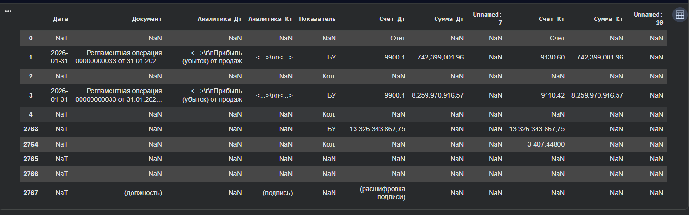
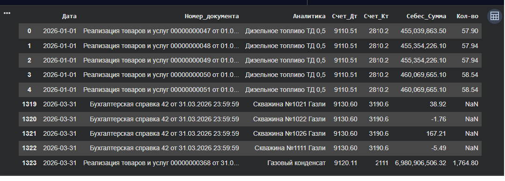
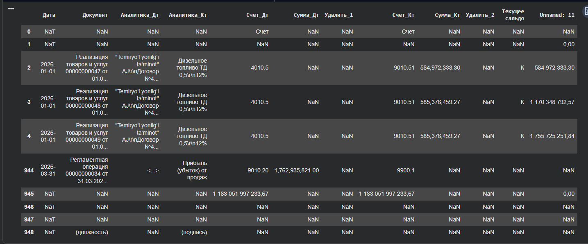
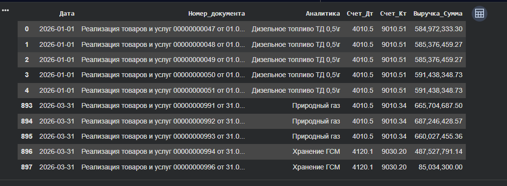
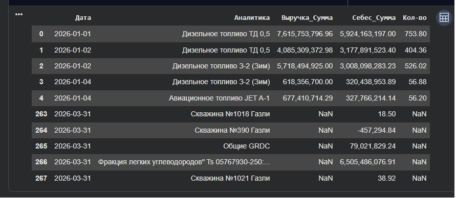

# Revenue & Cost of Sales ETL

Проект демонстрирует автоматизацию обработки учетных данных, выгруженных из 1С, с использованием Python (Pandas) и DuckDB SQL для подготовки аналитической отчетности по выручке и себестоимости.

## Используемые технологии

**Python • Pandas • NumPy • DuckDB SQL • ETL • Excel**

## Исходный код проекта

Полная реализация ETL-процесса доступна в ноутбуке:

[[📓 Открыть Jupyter Notebook](./Revenue_Cost_of_Sales_ETL_ipynb.ipynb)]

## Практическое применение

Проект основан на реальном сценарии автоматизации подготовки финансовой аналитической отчетности. Решение демонстрирует обработку и консолидацию выгрузок 1С, очистку и трансформацию данных с использованием Python (Pandas) и DuckDB SQL, а также формирование итоговой аналитической таблицы для дальнейшего использования в Excel и BI-системах. Исходные данные и пути к источникам обезличены для публичной публикации.

## Примеры этапов обработки данных

### 1. Исходная выгрузка по себестоимости

### 2. Очистка и преобразование данных по себестоимости

### 3. Исходная выгрузка по выручке

### 4. Очистка и преобразование данных по выручке

### 5. Итоговая аналитическая таблица

